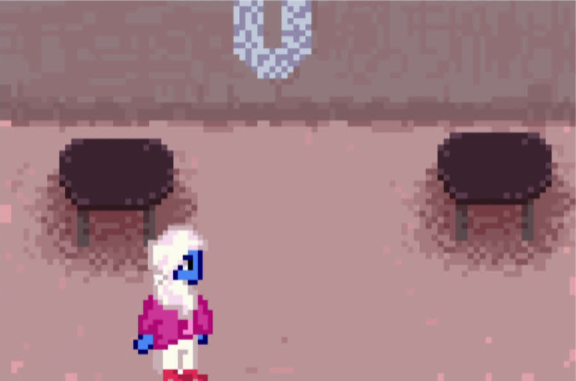
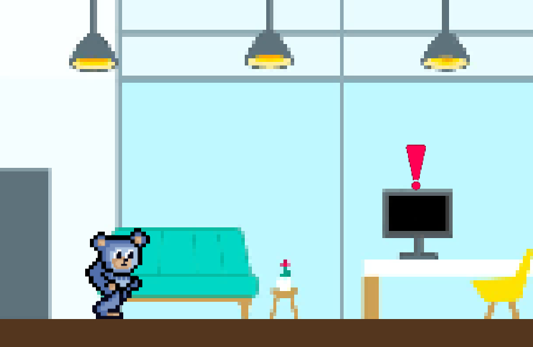

# GDD - Game Design Document - Módulo 1 - Inteli

**_Os trechos em itálico servem apenas como guia para o preenchimento da seção. Por esse motivo, não devem fazer parte da documentação final_**

## Pontual.org - UniLevel

#### Ana Beatriz Passos Beggiato
#### Eduardo Farias Rizk
#### Felipe de Melo Elgenneni
#### Fernanda Correia Nascimento
#### Lucas Guerra Vicente
#### Mariana Namie Guima
#### Pedro El Haouli Faria

## Sumário

[1. Introdução](#c1)

[2. Visão Geral do Jogo](#c2)

[3. Game Design](#c3)

[4. Desenvolvimento do jogo](#c4)

[5. Casos de Teste](#c5)

[6. Conclusões e trabalhos futuros](#c6)

[7. Referências](#c7)

[Anexos](#c8)

 

# 1. Introdução (sprints 1 e 4)

## 1.1. Escopo do Projeto

### 1.1.1. Contexto da indústria (sprints 1 e 4)

A indústria dos bens de consumo, uma das maiores do mundo, abrange desde alimentos até cuidados pessoais e limpeza, sendo os principais players desse ramo: “Unilever”, “Nestlé”, “Coca-Cola” e “Procter & Gamble”. Seus modelos de negócio estão se diferenciando para tentar atrair novos clientes, entretanto todas elas estão investindo em tecnologia de uma forma ou outra. As tendências entre essas multinacionais estão seguindo três pontos principais, sendo eles a personalização, a sustentabilidade e a inovação. Por ser um mercado altamente competitivo, muitas empresas estão tentando se adaptar para manter sua posição e tentar ampliar suas atividades.

### 1.1.2. Análise SWOT (sprints 1 e 4)

De acordo com a análise SWOT, a Unilever traz forças como ser uma empresa global, ter grande influência nos mercados atuantes e boa imagem. Como fraquezas, temos mercados saturados, diversificação de produtos em áreas com alta inflação. Além disso, a demanda mundial por empresas sustentáveis e a participação da empresa globalmente abre um grande leque de oportunidades. Já as ameaças são o risco de imitação de produtos, flutuações cambiais e de mudanças regulatórias e preocupações ambientais, podendo impactar diretamente as operações e a reputação da empresa.

Figura X - Análise SWOT 

Fonte: Material produzido pelos autores (2024)

### 1.1.3. Descrição da Solução Desenvolvida (sprints 1 e 4)

Atualmente, a Unilever encontra-se no processo de estruturação de seu Onboarding para funcionários de TI recém-contratados, tendo como principal desafio o engajamento deles nesse processo, garantindo a absorção de todas as informações transmitidas. Dado que a empresa é adepta do modelo de trabalho HibridUS, uma necessidade pós pandêmica que proporciona aos funcionários maior tempo em contato com ferramentas tecnológicas, e que os novos colaboradores geralmente estão destinados às carreiras junior - e, por isso, costumam ser mais jovens -, a solução proposta precisa abranger o ambiente web e não pode parecer infantil.

Diante desse cenário, a solução proposta consiste no desenvolvimento de uma aplicação interativa que proporcionará uma experiência envolvente na qual o colaborador, representado por um personagem virtual, navegará pelas instalações da empresa, desempenhando tarefas que têm como propósito transmitir de maneira eficaz os valores e missões  da empresa, tal como demais informações cruciais presentes no processo de integração. Podendo ser acessado pelo próprio colaborador em seu notebook de trabalho, o jogo deve ser iniciado após o processo geral de Onboarding da empresa, para que o funcionário passe a ter contato com as informações específicas de sua área - como explicações sobre determinados vocabulários e processos.

Através da utilização desta aplicação, será possível não só  motivar o funcionário a realizar o Onboarding, mas também garantir que ele tenha acesso a todas as informações necessárias para integrar-se na empresa. No mais, a organização poderá verificar a realização ou não do processo, assim como o nível de absorção das informações por parte do novo colaborador. 

Ademais, visando mensurar o sucesso da aplicação, será utilizado o nível de aceitação dos funcionários quanto a ferramenta, assim como a eficácia dela no que tange a realização do processo de Onboarding e a absorção das informações nele transmitidas.

### 1.1.4. Proposta de Valor (sprints 1 e 4)

Figura X - Proposta de Valor 

Fonte: Material produzido pelos autores (2024)

### 1.1.5. Matriz de Riscos (sprints 1 e 4)

Figura X - Matriz de risco 

Fonte: Material produzido pelos autores (2024)

#### Plano de ação
- Queda de energia: Caso ocorra uma queda de energia, o jogo ainda pode ser acessado pelos celulares, através do navegador. Entretanto, como o foco do jogo é sua execução em computadores, uma ação a ser realizada futuramente é o refinamento de sua versão para celular, a fim de que sua utilização seja igualmente proveitosa, mesmo com quedas de energia.

- Má interpretação das informações: Ocorrendo uma má interpretação, por parte dos usuários, das informações disponíveis no game, será necessária a reformulação delas, buscando cada vez mais clareza e objetividade na sua redação.

- Falta de informações disponíveis: Por conta das informações disponíveis serem insuficientes para o desenvolvimento integral do jogo, será necessário buscar auxílio diretamente com a Unilever. Se, ainda assim, a disponibilização dessas informações for impossibilitada por qualquer motivo, será necessário informar ao usuário de que aquela informação deve ser buscada em outros canais adequados.

- Bugs: Havendo a presença de bugs no game, será necessário o aumento dos casos de teste, a fim de identificar o bug e, consecutivamente, reformular o código a fim de que eles deixem de acontecer.

- Perda de arquivos: A fim de evitar que um membro da equipe esqueça de fazer backup e perca os arquivos de desenvolvimento do projeto, é necessário não só que todos estejam atentos quanto a isso, mas também que qualquer mínima alteração seja salva online e na máquina de todos os integrantes do grupo. Feito isso, mesmo que uma alteração não seja salva, a versão anterior estará disponível, evitando que o projeto precise ser retomado desde o começo.

- Queda de servidor: Ocorrendo uma queda de servidor, será necessário que a página do game emita um aviso informativo sobre ela, para que o usuário fique ciente e tente utilizar após algum tempo, esperando o retorno do servidor.

- Maior prestígio da empresa: Para garantir o aumento de prestígio da Unilever por meio do game, será necessário divulgar a funcionalidade dele, assim como sua aplicação prática e sua efetividade. A empresa já possui um onboarding muito bem avaliado e, portanto, a divulgação de sua gamificação - a qual torna-o mais atraente- proporcionará à empresa um prestígio ainda maior.

- Metaverso: Com a difusão do metaverso, será possível elevar ainda mais a interatividade do game, proporcionando experiências cada vez melhores para os colaboradores. Portanto, a fim de que tal fato realmente ocorra, é necessário adaptar o jogo para o metaverso assim que este ficar acessível para uma parcela maior da população, podendo ser acessado durante o processo de Onboarding da empresa.

## 1.2. Requisitos do Projeto (sprints 1 e 2)

*Posicione aqui a lista de requisitos levantados para o projeto, sejam pedidos do parceiro ou invenções do grupo. Descreva-os de forma objetiva, de modo que seja possível entender claramente como implementá-los tecnicamente.*

*ATUALIZE ESTA SEÇÃO SEMPRE QUE ALGUM REQUISITO MUDAR EM SEU PROJETO*

*Exemplo de tabela de requisitos*

\# | Requisito  
--- | ---
1 | Apresentar a organização e divisão da área de IT
2 | Apresentação do mundo Unilever (informações públicas da empresa)
3 | Apresentar o que é UniOps
4 | Ambientação web
5 | Ser uma trilha indidvidual
6 | Apresentar o compromisso da empresa com a sustentabilidade
7 | Metrificar a absorção do conteúdo por parte do jogador
8 | Colher feedback sobre o conteúdo do game
9 | Ser um HUB de links
10 | Incluir checkpoints
11 | Ter uma página ou fase de tutorial
12 | Ter interação com NPCs
13 | Resolução de tarefas ao longo do jogo

## 1.3. Público-alvo do Projeto (sprint 2)

Figura X - Público Alvo 

Fontes: LinkedIn da Unilever e questionário enviado para a Unilever.

Figura X - Público Alvo 

Fontes: LinkedIn da Unilever e questionário enviado para a Unilever.

Figura X - Público Alvo 

Fontes: LinkedIn da Unilever e questionário enviado para a Unilever.

Figura X - Público Alvo 

Fontes: LinkedIn da Unilever e questionário enviado para a Unilever.

O jogo não precisa ser projetado especificamente para pessoas que nunca jogaram, pois, de acordo com um questionário enviado à Unilever, os funcionários da área de TI já têm experiência com jogos, variando de títulos simples a jogos como Call of Duty. Isso simplifica o desenvolvimento do jogo, permitindo que aspectos básicos, como movimentação e interação com bots, sejam intuitivos para os jogadores.

As informações foram coletadas principalmente do perfil da Unilever no LinkedIn, o que permitiu identificar o público-alvo do jogo como pessoas de diversas localidades ao redor do mundo, com uma presença significativa especialmente no México, Espanha e Argentina. Por isso, nosso jogo deve adotar um idioma padrão e desenvolver o jogo todo nessa língua. A faixa etária principal dos jogadores é de 30 a 40 anos. Também foi possível obter detalhes adicionais sobre os funcionários, desde as universidades onde estudaram até as principais competências que possuem, isso ajuda a se aproximar mais daqueles que vão jogar o jogo.

Fontes: LinkedIn da Unilever e questionário enviado para a Unilever.

# 2. Visão Geral do Jogo (sprint 2)

## 2.1. Objetivos do Jogo (sprint 2)

O intuito primário do jogo é resgatar as marcas da Unilever do controle de um Hacker que invadiu o seu sistema. Para combatê-lo, o jogador precisa terminar as fases respondendo uma pergunta, que lhe concederá uma letra-chave para desligar o sistema do hacker. Tendo isso em mente, o game tem como objetivo indireto tornar o Onboarding uma experiência leve e divertida para os novos funcionários da Unilever, por meio da mescla entre o jogo de plataforma e as perguntas. 

## 2.2. Características do Jogo (sprint 2)

### 2.2.1. Gênero do Jogo (sprint 2)

Pensando em criar um jogo que se encaixe aos gostos do público alvo do jogo, ou seja, aos novos funcionários da Unilever; foi criado um formulário com as opções de preferências por diferentes gêneros de jogos. Segundo as respostas recebidas, grande parte dos dados coletados indicou uma tendência à escolha de games de ação e aventura. Por conta disso, nós desenvolvemos um jogo que mistura a fantasia das marcas da Unilever com a aventura de resgatá-las de um hacker. 

### 2.2.2. Plataforma do Jogo (sprint 2)

A plataforma de um jogo é o local ou servidor em que o game é carregado e exibido aos jogadores; assim, ele pode ser rodado em desktops, mobiles, etc. Por conta dos requisitos propostos pelo cliente, nós decidimos que o jogo rodará na Web de dispositivos desktop. 

### 2.2.3. Número de jogadores (sprint 2)

A fim de facilitar o controle de dados da progressão de cada participante no Onboarding, o jogo apresentará somente um jogador; uma vez que isso otimiza a interação dele com os conteúdos e links da Unilever.

### 2.2.4. Títulos semelhantes e inspirações (sprint 2)

O jogo se inspirou em "Super Mário Bros", uma vez que utilizamos a dinâmica de plataformas e inimigos para que o player encontre desafios. Além disso, durante a progressão do jogo, aparecem em certas fases objetos que empurram o player ou caem e causam dano a ele. Ademais, há um quiz no final da fase que é inspirado em "Trivia Quest", sendo necessário para testar os conhecimentos do jogador sobre a Unilever e computar o seu aprendizado por um sistema de pontuações. Por fim, a fase da "Knorr" foi influenciada pela dinãmica de "Flappy Bird", em que o jogador deverá surfar por uma sopa e evitar colidir com colunas representadas por garfos.

### 2.2.5. Tempo estimado de jogo (sprint 5)

Espera-se que o deslocamento pelas plataformas dure cerca de 2 minutos, sem contar com o tempo necessário para ler os links da Unilever. Considerando que a leitura dos seis links demore 20 minutos cada, o tempo total do jogo deverá ser cerca de 2h20min.

# 3. Game Design (sprints 2 e 3)

## 3.1. Enredo do Jogo (sprints 2 e 3)

A primeira cena do jogo UniLevel se passa na casa do personagem controlável, o Ursinho Fofo, que anda até o computador posicionado na mesa do seu escritório. Uma notificação aparece no topo do Desktop que indica um novo pop-up, neste, um hacker descreve seu plano de tomar a Unilever para si, roubando as marcas e mantendo-as em um cativeiro protegido por senha. Então, o jogador recebe a função de salvar cada uma das marcas, sendo teletransportado por meio de um portal mágico para dentro do próprio computador.

Ao acordar dentro do universo fantástico, é apresentado o primeiro cenário: O Mundo OMO, um espaço azul escuro com plataformas de pregador de roupa, diversas bolhas de sabão e roupas penduradas ou jogadas em todo canto. Seu primeiro objetivo é passar pelas bactérias das roupas sujas e alcançar a YoUNI, NPC onipresente guia de jornada, que mostrará o caminho de acesso às informações (link) que o jogador precisa para desbloquear a primeira letra da senha de desbloqueio das marcas. Ao voltar, o personagem é direcionado a uma pergunta sobre o material lido, e acertando esta, recebe a letra junto com a primeira marca liberada: o OMO em pó.

Seguindo por um elevador, o jogador vai para o próximo cenário: A Floresta da Mãe Terra, um mundo repleto de árvores e plantações, porém infestado com besouros que comem os biscoitos naturais que brotam da terra. Seguindo por plataformas desses mesmos comestíveis, o jogador alcança YoUNI, recebendo outro link e mais uma pergunta, que, ao ser respondida corretamente, liberta a segunda letra e o Jacaré Zooreta. 

Logo após sair de outro elevador, é apresentado o banheiro da Dove, coberto por azulejos, shampoos e condicionadores. Nesse nível, o nível de dificuldade da plataforma é aumentado, uma vez que o jogador é arrastado pela força de propulsão de um desodorante ao longo do piso ensaboado, escorregando pelos azulejos até uma bolha de fedor, o inimigo da fase. Quando alcançar YoUNI, é liberado o terceiro link e pergunta que, ao ser acertada, libera a letra e a Pomba da Dove.

Na saída seguinte do elevador, o jogador se depara com o Freezer Kibon, um mundo doce com montanhas de sorvete, canudos de chocolate e colheres. O inimigo dessa fase não é um NPC, mas gotas de cobertura derretida caindo do teto do freezer, que podem atingir o jogador. Seguindo a mesma lógica das anteriores, o objetivo é alcançar a guia, desbloqueando o link, a pergunta, a letra e, dessa vez, o Picolé Tablito.

Em sequência, é mostrada a ‘Dogueria’ da Hellmann's, um espaço coberto por um cachorro-quente gigante com molhos da marca. As plataformas são baseadas nos recipientes dos condimentos, os tubos de mostarda e ketchup, dessa vez, os vilões da fase são exércitos de batatas palha, que atrapalham o alcance do fim. Encontrando YoUNI, são liberados os materiais necessários para a passagem de nível e o Pote de Maionese.

Por último, o jogador chega no Mar de Letrinhas da Knorr, uma sopa gigante com massas flutuando. Seu principal desafio será passar por plataformas verticais semelhantes ao jogo “Flappy Bird”, evitando encostar nos garfos gigantes que estão nas extremidades da sopa. Quando alcança a NPC guia no meio do mapa, ele desbloqueia os conteúdos para conseguir a última letra e retoma sua jornada fugindo das plataformas. Ao fim, ele recupera a galinha do Caldo Knorr quando responde corretamente o quiz.

Quando alcança o final do game, o jogador precisa inserir as seis letras obtidas para abrir o cofre e salvar a Unilever do hacker. Assim que essa missão é cumprida, o mesmo portal do início se abre, teletransportando o personagem de volta para o escritório em sua forma humana. Agora, os personagens salvos aparecem no ambiente, agradecendo pela coragem do jogador e finalizando o jogo.

## 3.2. Personagens (sprints 2 e 3)

### 3.2.1. Controláveis

Os personagens são modelos em pixel art baseados no Ursinho Fofo, mascote embaixador da marca de amaciantes Fofo da Unilever. Os controláveis homônimos seguem a mesma paleta de cores do rebranding divulgado em 2023, sendo quatro opções de escolha: Azul, bege, rosa-vermelho e laranja-roxo. Seu design é baseado primariamente nas sprites do Megaman 1987, da Capcom para o Nintendo Entertainment System.

Os objetivos delegados ao personagem vão desde a leitura dos documentos e acesso dos links enviados pela Unilever até a resposta de perguntas relacionadas a esses conteúdos, desbloqueando letras de uma palavra-chave a ser utilizada para salvar os NPC-marcas do ataque de hackers. Durante a realização de tarefas, o jogador consegue mover a persona para frente, para trás e pular em um modelo plataforma de mundo. Além disso, tendo em vista que, apesar de estar preso em um mundo virtual, o controlável é uma personificação do funcionário de TI, foi acordado pela equipe de não incluir habilidades sobre humanas ou de luta. 

### 3.2.2. Non-Playable Characters (NPC)

Ao longo do jogo, existem quatro tipos de NPC´s: O hacker, vilão principal do jogo que aparece por meio de mensagens no computador do personagem controlável; o personagem que direciona o acesso aos links no meio de cada fase; as próprias marcas a serem salvas e os capangas de cada nível. Cada um deles segue a paleta de cores especificada no Kit Media enviado pela Unilever ou a cor padrão dos produtos já existentes e também se comportam como modelos em pixel art.

O hacker não apresenta características físicas e se comporta apenas como pop-ups no computador do personagem. 

Por sua vez, o NPC guia YoUNI, que dá acesso aos links, possui a aparência de uma mulher azul que utiliza um hijab branco e roupas rosa pastel, baseada em uma das personagens autorais da própria Unilever.

Os NPC-marcas são os que apresentam características mais diversas, sendo:
* OMO: O NPC da marca é uma caixa de sabão em pó que comporta o branding antigo da marca (anos 2000), metade do corpo dividido em tons de vermelho e azul vibrantes com pontos de luz brancos no centro.
* Mãe Terra: O NPC da marca é o jacaré da linha alimentícia Zooreta, a versão escolhida foi a paleta de cores do salgadinho assado de queijo, contando com uma blusa branca, casaco laranja e calça azul com detalhes em amarelo.
* Dove: O NPC da marca é a pomba característica dos produtos em seu rebranding mais atual, cor dourada com textura metálica brilhante, que reluz um ponto de luz branco em seu centro.
* Kibon: O NPC da marca é o picolé Tablito, um sorvete de palito com a parte externa em paletas de cor off-white (chocolate branco) repleto de pontinhos amarelados (amendoins) e interior marrom (chocolate ao leite). Esse personagem também conta com um palito em um tom marrom mais claro e uma “mordida” em seu topo, seguindo o modelo da foto que embala o próprio picolé em sua versão atual.
* Hellmann’s: O NPC da marca é o pote de maionese característico de 500g. Ele segue a mesma paleta de cores do produto original porém um aspecto mais personificado para dar mais “vida” ao personagem.
* Knorr: O NPC da marca é a galinha que ilustra a caixinha de Caldo Knorr sabor galinha. Ela possui uma paleta de cores branca em seu interior e um contorno vermelho no exterior, seguindo o modelo que aparece estampado nos produtos. Seu vime e crista seguem a mesma tonalidade avermelhada, no entanto, fugindo do usual, seu bico é branco.

Da mesma forma, cada nível apresenta seus respectivos capangas, NPCs cujo objetivo é atrapalhar a passagem de fase, assim, eles se comportam como:
* OMO: Os NPCs capangas da marca são bactérias das roupas sujas que atacam o jogador, fazendo-o voltar para o início da fase e dificultando seus avanços. Elas seguem uma paleta de cores voltada para o rosa e fímbrias (protuberâncias) amareladas, contrastando com o tom azulado do background.
* Mãe Terra: Os NPCs capangas da marca são besouros que atacam o jogador. Eles comportam cores mais escuras voltadas para o marrom e o preto. contrastando com o verde do background folhado.
* Dove: Os NPCs capangas da marca são bolhas de sujeira e fedor que incapacitam o avanço do jogador. Elas possuem tons transparentes voltados para o verde e o marrom, além de semblantes furiosos. 
* Kibon: A marca não possui NPCs capangas, ao invés disso, a dificuldade da fase está em escapar de gotas de cobertura derretida caindo do topo da tela.
* Hellmann’s: Os NPCs capangas da marca são exércitos de batata palha, que carregam lanças pretas afiadas. Eles seguem uma tonalidade amarela mais vibrante com detalhes em marrom, representando um gradiente característico de fritura, além de possuírem rostos bravos.
* Knorr: A marca não possui NPCs capangas, ao invés disso, são colocadas plataformas verticais no estilo “Flappy Bird” que o jogador deve evitar.

### 3.2.3. Diversidade e Representatividade dos Personagens

Considerando as personagens do game, analise se estas estão alinhadas ao público-alvo do jogo (seção 1.3), e compare-as dentro da realidade da sociedade brasileira. Por fim, discorra sobre qual é o impacto esperado da escolha dessas personagens.

## 3.3. Mundo do jogo (sprints 2 e 3)

### 3.3.1. Locações Principais e/ou Mapas (sprints 2 e 3)

O jogo ocorre em um cenário lúdico, o qual representa a temática de um dos produtos da Unilever em cada fase.  Abaixo, segue uma tabela com as fases e seus respectivos temas: 

Tabela x - Planejamento das fases 

|Fase|Marca| Background | Plataforma | Inimigo| 
|--------|---------|-----------------------| ------ | ---| 
|1|Introdução| Escritório da Unilever | Computador rackeado| Não há | 
|2|Omo| Parede com bolhas de sabão na área inferior e roupas penduradas na parte superior| Pregadores de roupa, máquina de lavar e cesto de roupas| Bactéria | 
|3|Mãe Terra| Fundo de floresta | Biscoito e pacote de bolacha | Besouro| 
|4|Dove| Parede quadriculada de banheiro com shampoo e condicionador | Barra de sabonete e caixa de sabonete| Desodorante que empurra para frente| 
|5| Kibon | Montanhas de sorvete | Canudo de chocolate e colher | Gotas de sorvete derretido| 
|6|Hellman's| Fundo de cachorro-quente | Maionese | Batata frita| 
|7|Knorr| Imitação de sopa | Colher e enlatado | Garfo | 

Fonte: Material produzido pelos autores (2024)

### 3.3.2. Navegação pelo mundo (sprints 2 e 3)

O jogo ocorre em plataforma, sendo inspirado na dinâmica de "Super Mário Bros" de 1986. Na primeira fase, o player é abduzido por um computador que foi invadido por um hacker, o qual sequestra os produtos da Unilever. Ao ser teletransportado, o jogador vai para a próxima fase e é responsável por resgatar uma das marcas e encontrar a NPC YoUni, que entregará ao player um link do Onboarding da Unilever. 

Após isso, ele continua até o final da fase e encontra um quiz, que testa o conteúdo aprendido no link. Caso o player acerte, ele recebe uma pontuação, uma letra-chave que será essencial para desligar o sistema do invasor na última fase e a permissão para passar pelo portal que o levará à próxima fase. Entretanto, se o jogador errar, ele deve responder a mesma questão até acertar, havendo diminuição de pontos da questão a cada equívoco. A mesma dinâmica ocorre em todas as fases, mudando apenas a marca a ser resgatada. 

### 3.3.3. Condições climáticas e temporais (sprints 2 e 3)

*\<opcional\> Descreva diferentes condições de clima que podem afetar o mundo e as fases, se aplicável*

*Caso seja relevante, descreva como o tempo passa, se ele é um fator limitante ao jogo (ex. contagem de tempo para terminar uma fase)*

### 3.3.4. Concept Art (sprint 2)

Para a tela de início, pensamos em fazer "Easter eggs", ou seja, referências das próximas cenas do jogo e dos produtos da Unilever; a fim de apresentar a estética do game. A seguir, pode-se observar a concept art inicial e a sua paleta de cores: 

Figura X - Concept art da cena 0 

Fonte: Material produzido pelos autores (2024)

Figura X - Paleta de cores da cena 0 

Fonte: Material produzido pelos autores (2024)

Já para a primeira fase, pensamos em representar o escritório da Unilever com cores saturadas e vibrantes, onde o player encontrará o computador hackeado e será teletransportado para a dimensão dos produtos da Unilever. 

Figura X - Concept art da cena 1 

Fonte: Material produzido pelos autores (2024)

Figura X - Paleta de cores da cena 1 

Fonte: Material produzido pelos autores (2024)

Para a segunda fase, criamos um background inspirado em uma lavanderia com roupas penduradas e sabão espalhado pelo chão, a fim de condizer com a "Omo". Além disso, desenhamos pregadores e máquinas de lavar como plataformas dentro dessa mesma temática e uma bactéria que representa o inimigo. Também foi criado um NPC de uma caixa da Omo para que ele seja salvo durante a cena pelo player. 

Figura X - Concept art da cena 2 

Fonte: Material produzido pelos autores (2024)

Figura X - Paleta de cores da cena 2 

Fonte: Material produzido pelos autores (2024)

Figura X - Concept art do Omo 

Fonte: Material produzido pelos autores (2024)

Figura X - Paleta de cores da Omo 

Fonte: Material produzido pelos autores (2024)

Em relação à terceira fase, fizemos um campo aberto com uma árvore que representa a logo da "Mãe Terra" e algumas plantas, as quais também aparecem em várias embalagens da marca. Para representar a marca a ser resgatada, utilizamos um jacaré que aparece em alguns pacotes de biscoito. Por fim, projetamos as plataformas como bolachas e pacotes de biscoito para referenciar algumas mercadorias e utilizamos um besouro como inimigo. 

Figura X - Concept art da cena 3 

Fonte: Material produzido pelos autores (2024)

Figura X - Paleta de cores da cena 3 

Fonte: Material produzido pelos autores (2024)

Figura X - Concept art do Jacaré Zooreta da Mãe Terra 

Fonte: Material produzido pelos autores (2024)

Figura X - Paleta de cores do Jacaré Zooreta da Mãe Terra 

Fonte: Material produzido pelos autores (2024)

Para a quarta cena, pensamos em fazer um background como um fundo de banheiro que tem suportes de shampoo e condicionador e plataformas com a temática da "Dove". Também foi desenhada uma pomba como NPC a ser salvo a fim de representar a logo da marca. Ademais, o fase conta com que desodorante que empurra com um jato o jogador constantemente para a frente e uma "nuvem de fedor" como inimigo. 

Figura X - Concept art da cena 4 

Fonte: Material produzido pelos autores (2024)

Figura X - Paleta de cores da cena 4 

Fonte: Material produzido pelos autores (2024)

Figura X - Concept art da pomba Dove 

Fonte: Material produzido pelos autores (2024)

Figura X - Paleta de cores da pomba Dove 

Fonte: Material produzido pelos autores (2024)

Na quinta fase, há várias bolas de sorvete com cobertura de chocolate no background e plataformas representadas por canudos de chocolate e um pote de sorvete com a logotipo da "Kibon". Para o NPC sequestrado, pensamos em utilizar o picolé "Tablito" com uma mordida na ponta. Nessa cena, o inimigo será uma calda de chocolate que está constantemente pingando gotas que, se encostarem no player, o levará a retornar a cena desde o início. 

Figura X - Concept art da cena 5 

Fonte: Material produzido pelos autores (2024)

Figura X - Paleta de cores da cena 5 

Fonte: Material produzido pelos autores (2024)

Figura X - Concept art do Tablito Kibon 

Fonte: Material produzido pelos autores (2024)

Figura X - Paleta de cores do Tablito Kibon 

Fonte: Material produzido pelos autores (2024)

Para a sexta cena com temática "Hellmann's", fizemos um fundo de cachorro-quente e plataformas de maionese e mostarda, que contarão com um inimigo ilustrado como uma batata frita. A fase também possui um pote de maionese como NPC a ser regatado. 

Figura X - Concept art da cena 6 

Fonte: Material produzido pelos autores (2024)

Figura X - Paleta de cores da cena 6 

Fonte: Material produzido pelos autores (2024)

Figura X - Concept art da Maionese da Hellmann's 

Fonte: Material produzido pelos autores (2024)

Figura X - Paleta de cores da Maionese da Hellmann's 

Fonte: Material produzido pelos autores (2024)

Na última fase jogável, utilizamos um fundo de sopa para tematizar a "Knorr" e garfos como barreiras para a passagem do jogador até seu destino final, assim como plataformas de enlatados. 

Figura X - Concept art da cena 7 

Fonte: Material produzido pelos autores (2024)

Figura X - Paleta de cores da cena 7 

Fonte: Material produzido pelos autores (2024)

Figura X - Concept art da galinha da Knorr 

Fonte: Material produzido pelos autores (2024)

Figura X - Paleta de cores da galinha da Knorr 

Fonte: Material produzido pelos autores (2024)

Finalmente, o jogador é liberado para voltar ao escritório da Unilever, ou seja, para a cena 1; onde ele é parabenizado e tranferido para a tela final de agradecimentos ilustrada abaixo, a qual possui o tempo de jogo e a pontuação obtida durante o seu decorrer. 

Figura X - Concept art da cena 8 

Fonte: Material produzido pelos autores (2024)

Figura X - Paleta de cores da cena 8 

Fonte: Material produzido pelos autores (2024)

Caso o player tenha colidido com algum inimigo durante a partida, ele será transferido para a tela de "game over", onde ele terá que reiniciar a fase; não sendo necessário começar o jogo desde a cena inicial do escritório da Unilever. 

Figura X - Concept art da cena game over 

Fonte: Material produzido pelos autores (2024)

Figura X - Paleta de cores da cena game over 

Fonte: Material produzido pelos autores (2024)

### 3.3.5. Trilha sonora (sprint 3)

*Descreva a trilha sonora do jogo, indicando quais músicas serão utilizadas no mundo e nas fases. Utilize listas ou tabelas para organizar esta seção. Caso utilize material de terceiros em licença Creative Commons, não deixe de citar os autores/fontes.*

*Exemplo de tabela*
\# | título | ocorrência | autoria
--- | --- | --- | ---
1 | tema de abertura | tela de início | própria
2 | tema de combate | cena de combate com inimigos comuns | Hans Zimmer
3 | ... 

## 3.4. Inventário e Bestiário (sprint 3)

### 3.4.1. Inventário

*\<opcional\> Caso seu jogo utilize itens ou poderes para os personagens obterem, descreva-os aqui, indicando títulos, imagens, meios de obtenção e funções no jogo. Utilize listas ou tabelas para organizar esta seção. Caso utilize material de terceiros em licença Creative Commons, não deixe de citar os autores/fontes.* 

*Exemplo de tabela*
\# | item |  | como obter | função | efeito sonoro
--- | --- | --- | --- | --- | ---
1 | moeda |  | há muitas espalhadas em todas as fases | acumula dinheiro para comprar outros itens | som de moeda
2 | madeira |  | há muitas espalhadas em todas as fases | acumula madeira para construir casas | som de madeiras
3 | ... 

### 3.4.2. Bestiário

*\<opcional\> Caso seu jogo tenha inimigos, descreva-os aqui, indicando nomes, imagens, momentos de aparição, funções e impactos no jogo. Utilize listas ou tabelas para organizar esta seção. Caso utilize material de terceiros em licença Creative Commons, não deixe de citar os autores/fontes.* 

*Exemplo de tabela*
\# | inimigo |  | ocorrências | função | impacto | efeito sonoro
--- | --- | --- | --- | --- | --- | ---
1 | robô terrestre |  |  a partir da fase 1 | ataca o personagem vindo pelo chão em sua direção, com velocidade constante, atirando parafusos | se encostar no inimigo ou no parafuso arremessado, o personagem perde 1 ponto de vida | sons de tiros e engrenagens girando
2 | robô voador |  | a partir da fase 2 | ataca o personagem vindo pelo ar, fazendo movimento em 'V' quando se aproxima | se encostar, o personagem perde 3 pontos de vida | som de hélice
3 | ... 

## 3.5. Gameflow (Diagrama de cenas) (sprint 2)

Figura x - Diagrama de cenas

Fonte: Material produzido pelos autores (2024)

-**Tela inicial:** o jogador começa o jogo aqui, e basta clicar na tela para que o jogo se inicie. Para o desenvolvimento desta tela, foram colocadas referências à todas as fases do jogo, como sorvete, máquina de lavar, entre outros. Para a programação desta tela, a única classe utilizada até então foi a classe "Scene00", a qual ainda não tem atributos próprios e apresenta <code>create()</code> como único método. No mais, essa classe apresenta como única herança o atibuto <code>Phaser.scenes()</code>

-**Fase 1:** pensada para ser uma introdução à dinâmica do jogo, essa fase apresenta um cenário inicial de escritório no qual o personagem principal anda por ele, aprendendo os movimentos, e encongra o "computador hackeado" no qual iniciará sua imersão no game. Por ser uma fase de tutorial, ela não apresenta possibilidade de GameOver, sendo exclusivamente uma introdução às mecânicas e dinâmicas do jogo. Para o desenvolvimento dessa fase, a única classe utilizada até então foi a "Scene01", que não tem atributos próprios e apresenta <code>preload()</code>, <code>create()</code> e <code>update()</code> como métodos. No mais, essa classe apresenta como única herança o atibuto <code>Phaser.scenes()</code>

-**Fase 2:** temática da marca "Omo", essa fase será de plataforma, e além de responder o quiz do final, o jogador deve atravessar o cenário sem encostar na bactéria - inimigo cuja colisão com o player leva ao GameOver, trazendo a necessidade de reiniciar a fase (e não o game). Para o desenvolvimento dessa fase, a única classe utilizada até então foi a "Scene02", que não tem atributos próprios e apresenta <code>preload()</code>, <code>create()</code> e <code>update()</code> como métodos. No mais, essa classe apresenta como única herança o atibuto <code>Phaser.scenes()</code>

-**Fase 3:** temática da marca "Mãe Terra", essa fase também será de plataforma, e além de responder o quiz do final, o jogador deve atravessar o cenário sem encostar no besouro - inimigo cuja colisão com o player leva ao GameOver, trazendo a necessidade de reiniciar a fase (e não o game). O desenvolvimento dessa fase ainda não foi iniciado, mas deve seguir o padrão de programação das demais e, portanto, a única classe utilizada (a priori) será a "Scene03", que não tem atributos próprios e apresenta <code>preload()</code>, <code>create()</code> e <code>update()</code> como métodos. No mais, essa classe apresenta como única herança o atibuto <code>Phaser.scenes()</code>

-**Fase 4:** temática da marca "Dove", essa fase será de plataforma, dificultada pela inserção de gravidade no eixo x - simulando a força do aerosol de um desodorante - e, além de responder o quiz do final, o jogador deve atravessar o cenário sem encostar na bolha de fedor - inimigo cuja colisão com o player leva ao GameOver, trazendo a necessidade de reiniciar a fase (e não o game). O desenvolvimento dessa fase ainda não foi iniciado, mas deve seguir o padrão de programação das demais e, portanto, a única classe utilizada (a priori) será a "Scene04", que não tem atributos próprios e apresenta <code>preload()</code>, <code>create()</code> e <code>update()</code> como métodos. No mais, essa classe apresenta como única herança o atibuto <code>Phaser.scenes()</code>

-**Fase 5:** temática da marca "Kibon", essa fase será de plataforma, dificultada pela inserção de gotas de chocolate caindo do céu e, além de responder o quiz do final, o jogador deve atravessar o cenário sem encostar nessas gotas - inimigos cuja colisão com o player leva ao GameOver, trazendo a necessidade de reiniciar a fase (e não o game). O desenvolvimento dessa fase ainda não foi iniciado, mas deve seguir o padrão de programação das demais e, portanto, a única classe utilizada (a priori) será a "Scene05", que não tem atributos próprios e apresenta <code>preload()</code>, <code>create()</code> e <code>update()</code> como métodos. No mais, essa classe apresenta como única herança o atibuto <code>Phaser.scenes()</code>

-**Fase 6:** temática da marca "Hellman's", essa fase será também de plataforma e, além de responder o quiz do final, o jogador deve atravessar o cenário sem encostar nas batatas-fritas espalhadas pelo caminho - inimigas cuja colisão com o player leva ao GameOver, trazendo a necessidade de reiniciar a fase (e não o game). Como adicional de dificuldade deste nível, o player não poderá subir nas plataformas mais altas, mas terá de se "pendurar" nelas por baixo. O desenvolvimento dessa tela ainda não foi iniciado, mas deve seguir o padrão de programação das demais e, portanto, a única classe utilizada (a priori) será a "Scene06", que não tem atributos próprios e apresenta <code>preload()</code>, <code>create()</code> e <code>update()</code> como métodos. No mais, essa classe apresenta como única herança o atibuto <code>Phaser.scenes()</code>

-**Fase 7:** temática da marca "Knorr", essa fase será não será exatamente de plataforma, mas sim um estilo de "flap birdy" estilizado no qual o player, posicionado em uma prancha, precisará navegar entre os garfor que surgem debaixo e de cima da tela e, além de responder o quiz do final, o jogador deve atravessar o cenário sem encostar nesses garfos - inimigas cuja colisão com o player leva ao GameOver, trazendo a necessidade de reiniciar a fase (e não o game). Como adicional de dificuldade deste nível, o player não poderá subir nas plataformas mais altas, mas terá de se "pendurar" nelas por baixo. O desenvolvimento dessa fase ainda não foi iniciado, mas deve seguir o padrão de programação das demais e, portanto, a única classe utilizada (a priori) será a "Scene07", que não tem atributos próprios e apresenta <code>preload()</code>, <code>create()</code> e <code>update()</code> como métodos. No mais, essa classe apresenta como única herança o atibuto <code>Phaser.scenes()</code>

-**Tela Final:** projetada para ser o encerramento do jogo, esta tela apresentará o tempo levado pelo player no jogo, assim como a pontuação conquistada por ele nas respostas aos quizzes. Como trata-se de uma tela de encerramento, as únicas possibilidaddes para o jogador dentro dela são a de sair do jogo ou a de jogar novamente. O desenvolvimento desta tela ainda não foi iniciado, mas deve seguir o padrão de programação das demais e, portanto, a única classe utilizada (a priori) será a "Scene08", que não tem atributos próprios e apresenta <code>preload()</code>, <code>create()</code> e <code>update()</code> como métodos. No mais, essa classe apresenta como única herança o atibuto <code>Phaser.scenes()</code>

-**Tela GameOver:** essa é a tela que o jogador verá ao encostar em um inimigo, ou seja, quando perder o jogo. Visto que na concepção do jogo os autores decidiram por não possibilitar o retorno a fases anteriores, a tela de GameOver tem como única possibilidade o reinicio da fase que foi perdida, e não permite o reinicio do jogo inteiro. O desenvolvimento desta tela ainda não foi iniciado, mas deve seguir o padrão de programação das demais e, portanto, a única classe utilizada (a priori) será a "Scene08", que não tem atributos próprios e apresenta <code>preload()</code>, <code>create()</code> e <code>update()</code> como métodos. No mais, essa classe apresenta como única herança o atibuto <code>Phaser.scenes()</code>

## 3.6. Regras do jogo (sprint 3)

O jogador deve subir nas plataformas, desviar dos inimigos e de buracos no chão com o objetivo de resgatar a marca temática da presente fase em que ele está. Por fim, para passar para a próxima cena, o player deve responder um quiz referente ao conteúdo aprendido no link que foi entregue pela NPC YoUni. Abaixo, segue uma tabela com as pontuações recebidas pelas respostas corretas: 

Tabela X - Pontuação por tentativas de resposta

|Tentativas até acertar a questão| Pontuação recebida| 
|---|---| 
|1| 4| 
|2|2| 
|3|1| 
|4|0| 

Fonte: Material produzido pelos autores (2024)

## 3.7. Mecânicas do jogo (sprint 3)

O jogo ocorre em plataforma e o jogador pode ser controlado pelas setas "direita", "esquerda" e "cima" do teclado, que fazem o player se movimentar para frente, para trás e pular, respectivamente. Para interagir com NPC's e responder os quizes, deve-se clicar nos referidos com o mouse. Além disso, o player pode saltar nas plataformas, que estão flutuando durante as fases, e deverá fugir dos inimigos, os quais farão o jogador ser transferido à tela de game over e voltar para o início da fase caso eles colidam. Na fase da Kibon a dinâmica do inimigo será diferente, já que ele imitará uma cobertura de sorvete pingando; entretanto a regra de game over também será válida para essa cena.  Ademais, na fase da "Dove" haverá um desodorante que empurrará o player para a frente por meio de um jato constante, que o deslocará no eixo x para a direita. Por fim, na fase da "Knorr" o jogador deverá pressionar a tecla "espaço" a fim de fazer seu personagens voar, já que essa fase segue a mesma dinâmica de "Flappy Bird".

# 4. Desenvolvimento do Jogo

## 4.1. Desenvolvimento preliminar do jogo (sprint 1)

### 4.1.1 O que fizemos
Até o momento, nosso grupo se dedicou ao desenvolvimento do personagem do jogo, o que incluiu a definição da estética desejada e a criação de imagens para animação em diferentes ângulos: de frente, lado e de costas. Em termos de programação, implementamos a movimentação do personagem, permitindo-o mover-se para frente, para trás e para os lados. Além disso, integramos o cenário ao jogo e adicionamos a animação, que consiste em alterar a imagem do personagem conforme ele se move em diferentes direções. Adicionalmente, garantimos que a movimentação do personagem respeite os limites do cenário.

### 4.1.2 Desafios
Durante o desenvolvimento dessa primeira sprint tivemos dificuldades com a sintaxe do Javascript, uma vez que diversos erros ocorreram devido à ausência de vírgulas e à escrita errada de palavras. 
Também ocorreram empecilhos em relação à animação do personagem, já que tivemos que utilizar uma spritesheet piloto que não possuía todas as sprites; contudo, conseguimos escrever a programação básica da animação, a qual pode ser facilmente editada quando a spritesheet oficial for finalizada. Além disso, a criação da animação da posição de costas do player causou complicações, visto que o jogo travava quando a tecla "cima" era pressionada, ou seja, quando o personagem virava de costas. Entretanto, isso foi concertado a partir da revisão gramatical da função “this.anims.create”.

### 4.1.3 O que precisamos fazer
Nossos próximos passos para o jogo envolvem aprimorar o cenário, pois o atual limita bastante a experiência de jogo, já que o personagem ocupa uma grande parte da tela. Isso incluiria a criação de novas estruturas e objetos que o personagem poderia interagir e aprimorar. Além disso, é crucial desenvolvermos cenas, o que significa que o jogo teria uma tela inicial onde ao pressionar uma tecla, iniciaria e mudaria de cena.

Em relação ao personagem, decidimos que seria mais harmonioso se a câmera do jogo acompanhasse seus movimentos, o que contribuiria para a fluidez da jogabilidade.

## 4.2. Desenvolvimento básico do jogo (sprint 2)

Semana 1-2 (Jogo Isométrico):
- Durante as primeiras duas semanas, o jogo estava sendo desenvolvido como um jogo isométrico.
- Criação de assets isométricos, design de níveis e sistemas de jogo específicos para esse formato.
- A mudança de cenas foi programada nesse espaço de tempo
- Tela de início
  
  

Semana 3 (Transição para um “platformer”):
- Mudança do time de programação (Mariana e Eduardo -> Felipe e Lucas)
- mudança no paradigma, jogo isométrico, para um jogo “platformer” 2D
- implicou ajustes significativos nos assets, design de níveis, mecânicas de jogo e código
- compreensão do código antigo para tentar aproveitar o máximo durante essa transição
- início da cena 1 (início do jogo)

   Problema no Código de Digitação (Dias 1-4 da Semana 3):
    - Um erro de digitação acabou por atrasar a produção
    - Houve consideração para uma reescrita completa do código, mas isso foi evitado após a resolução do problema
   Programação Fluída (Após Resolução do Problema):
    - a programação do jogo ocorreu de forma fluida após esse ocorrido
    - início da implementação das mecânicas básicas
    -  O desenvolvimento se concentrou em implementar as mecânicas de “platformer” 2D, ajustar a física do jogo e integrar os novos assets
Semana 4
- finalização da implementação das mecânicas básicas
- finalização da cena 1
- comentários no código
- revisão do código
- início da cena 2 (Fase da Omo)
- Entregáveis da Versão Básica:
   
Uma versão básica do jogo foi entregue com os seguintes elementos:
- Mecânicas de “platformer” 2D funcionais
- Carregamento adequado de assets
- Design de níveis adaptado ao novo formato
- Correções de bugs relacionados à transição
Dificuldades:
- O principal desafio foi o problema no código de digitação que afetou o carregamento de imagens
- A transição rápida de um estilo de jogo para outro pode ter causado algumas complicações iniciais na integração dos sistemas
Próximos Passos:
- aprimorar as mecânicas e adicionar novas
- Realizar testes para identificar e corrigir possíveis bugs
- Adicionar novas fases 

## 4.3. Desenvolvimento intermediário do jogo (sprint 3)

*Descreva e ilustre aqui o desenvolvimento da versão intermediária do jogo, explicando brevemente o que foi entregue em termos de código e jogo. Utilize prints de tela para ilustrar. Indique as eventuais dificuldades e próximos passos.*

## 4.4. Desenvolvimento final do MVP (sprint 4)

*Descreva e ilustre aqui o desenvolvimento da versão final do jogo, explicando brevemente o que foi entregue em termos de MVP. Utilize prints de tela para ilustrar. Indique as eventuais dificuldades e planos futuros.*

## 4.5. Revisão do MVP (sprint 5)

*Descreva e ilustre aqui o desenvolvimento dos refinamentos e revisões da versão final do jogo, explicando brevemente o que foi entregue em termos de MVP. Utilize prints de tela para ilustrar.*

# 5. Testes (sprint 4)

## 5.1. Casos de Teste

*Descreva nesta seção os casos de teste comuns que podem ser executados a qualquer momento para testar o funcionamento e integração das partes do jogo. Utilize tabelas para facilitar a organização.*

*Exemplo de tabela*
\# | pré-condição | descrição do teste | pós-condição 
--- | --- | --- | --- 
1 | --- | o jogo começar do início | o jogo deve iniciar na cena 00
2 | Cena 00 | Clicar no botão esquerdo do mouse | mudar para a cena 01
3 | Cena 01 | Clicar na seta esquerda | O player se move para a esquerda
4 | Cena 01 | Clicar na seta direita | O player se move para a direita
5 | Cena 01 | Clicar na seta de cima | O player pula
6 | Cena 01 | Colidir com o player na área do Ponto de Exclamação | mudar para a cena 02
 

## 5.2. Testes de jogabilidade (playtests) (sprint 4)

### 5.2.1 Registros de testes

*Descreva nesta seção as sessões de teste/entrevista com diferentes jogadores. Registre cada teste conforme o template a seguir.*

Nome | João Jonas (use nomes fictícios)
--- | ---
Já possuía experiência prévia com games? | sim, é um jogador casual
Conseguiu iniciar o jogo? | sim
Entendeu as regras e mecânicas do jogo? | entendeu as regras, mas sobre as mecânicas, apenas as essenciais, não explorou os comandos complexos
Conseguiu progredir no jogo? | sim, sem dificuldades  
Apresentou dificuldades? | Não, conseguiu jogar com facilidade e afirmou ser fácil
Que nota deu ao jogo? | 9.0
O que gostou no jogo? | Gostou  de como o jogo vai ficando mais difícil ao longo do tempo sem deixar de ser divertido
O que poderia melhorar no jogo? | A responsividade do personagem aos controles, disse que havia um pouco de atraso desde o momento do comando até a resposta do personagem

### 5.2.2 Melhorias

*Descreva nesta seção um plano de melhorias sobre o jogo, com base nos resultados dos testes de jogabilidade*

# 6. Conclusões e trabalhos futuros (sprint 5)

*Escreva de que formas a solução do jogo atingiu os objetivos descritos na seção 1 deste documento. Indique pontos fortes e pontos a melhorar de maneira geral.*

*Relacione os pontos de melhorias evidenciados nos testes com plano de ações para serem implementadas no jogo. O grupo não precisa implementá-las, pode deixar registrado aqui o plano para futuros desenvolvimentos.*

*Relacione também quaisquer ideias que o grupo tenha para melhorias futuras*

# 7. Referências (sprint 5)

_Incluir as principais referências de seu projeto, para que seu parceiro possa consultar caso ele se interessar em aprofundar. Um exemplo de referência de livro e de site:_ 

LUCK, Heloisa. Liderança em gestão escolar. 4. ed. Petrópolis: Vozes, 2010.  
SOBRENOME, Nome. Título do livro: subtítulo do livro. Edição. Cidade de publicação: Nome da editora, Ano de publicação.  

INTELI. Adalove. Disponível em: https://adalove.inteli.edu.br/feed. Acesso em: 1 out. 2023  
SOBRENOME, Nome. Título do site. Disponível em: link do site. Acesso em: Dia Mês Ano

# Anexos

*Inclua aqui quaisquer complementos para seu projeto, como diagramas, imagens, tabelas etc. Organize em subtópicos utilizando headings menores (use ## ou ### para isso)*
